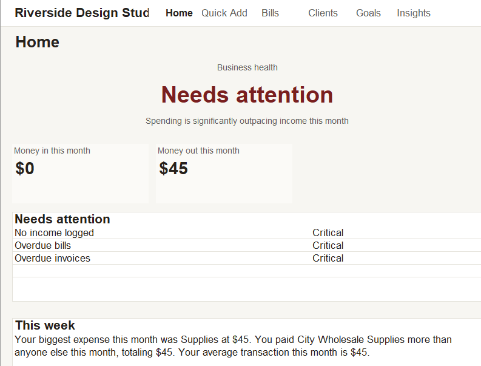
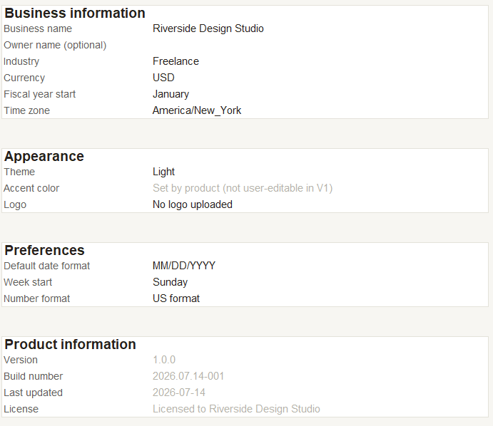
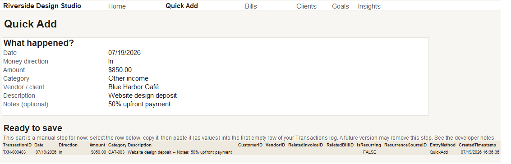
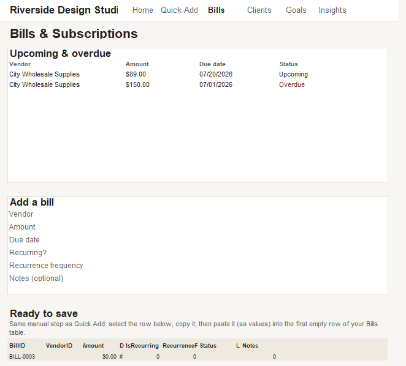
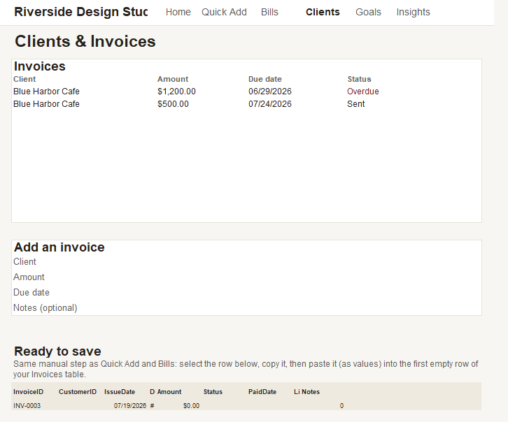
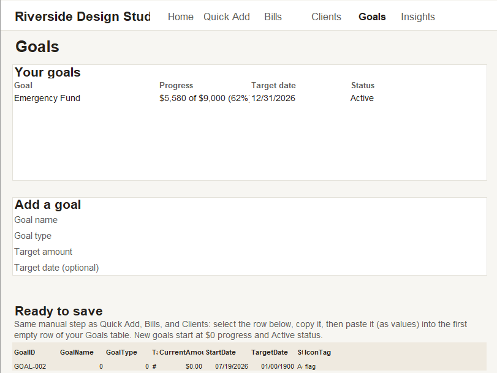

# Business Finance Pro
### A complete financial operating system for small businesses, built entirely in Microsoft Excel — no VBA, no macros.


---

## What is this?

Business Finance Pro is a complete financial dashboard, transaction tracker, and business-health monitor for freelancers, shop owners, and small service businesses — built entirely inside a single `.xlsx` file, with no VBA, no macros, no add-ins, and no external dependencies.

It was designed and built end-to-end following a real software product process: product requirements, UX design, a locked data model, a formal design system, and a workbook architecture treating Excel as a database, calculation engine, and presentation layer simultaneously — the same separation of concerns a real SaaS product would use.

## Getting Started

1. Download **Business Finance Pro v1.0.xlsx**
2. Open the workbook in Microsoft Excel 365 or Excel 2021.
3. Enable editing if prompted.
4. Review the included documentation for setup instructions and feature overview.
5. Begin tracking your business finances using the dashboard and guided workflows.

> No installation, macros, or add-ins are required.

## Why Excel?

The target user already has Excel, already trusts it, and won't install a new app or hand their financial data to a cloud service. Business Finance Pro meets them where they are, while deliberately not *looking* or *feeling* like a spreadsheet — no visible gridlines, no raw formulas on screen, no accounting jargon.

## Key Features

- **Home Dashboard** — a live Business Health indicator, this month's Money In/Out, a prioritized Needs Attention list, and a plain-language "Monday Briefing" narrative
- **Quick Add** — guided transaction entry
- **Bills & Subscriptions** — track what you owe, with automatic overdue detection
- **Clients & Invoices** — track what you're owed
- **Goals** — savings/revenue targets with live progress tracking
- **Settings** — business profile and preferences, no raw data editing required
- Four independent, rule-based calculation engines (Business Health, Needs Attention, Insights, and a shared metrics core) — formulas only, zero AI, zero macros

## Project Status

**Version 1.0 Released.**

Business Finance Pro v1.0 is the first public release of the project. The workbook has completed internal QA, documentation, and release packaging.

See [`CHANGELOG.md`](./CHANGELOG.md) for version history and [`docs/Business-Finance-Pro-Documentation.pdf`](./docs/Business-Finance-Pro-Documentation.pdf) for complete technical and user documentation.

## Repository Structure

```
BusinessFinancePro-Release/
├── README.md                                  <- you are here
├── LICENSE.md
├── CHANGELOG.md
├── RELEASE_NOTES_v1.0.md
├── Business Finance Pro v1.0.xlsx              <- primary workbook               
├── docs/
│   ├── Business-Finance-Pro-Documentation.pdf  <- full technical + user documentation
│   └── architecture-diagram.mmd                <- Mermaid source, also renders on GitHub
├── screenshots/
│   └── SCREENSHOTS_GUIDE.md                    <- what to capture, and in what order, for the portfolio
└── assets/
    ├── BRANDING_GUIDE.md                       <- color palette, typography, logo usage
    ├── logo/
    │   ├── logo-mark.svg
    │   └── logo-wordmark.svg
    └── icons/
        └── favicon.svg
```

## Technical Snapshot

| | |
|---|---|
| Sheets | 20 total — 6 visible, 14 hidden |
| Excel Tables | 9 |
| Named Ranges | 106 |
| Formulas | 425 |
| Data Validation Rules | 46 |
| Conditional Formatting Rules | 31 |
| Calculation Engines | 4 (`_calc_Core`, `_calc_Health`, `_calc_Attention`, `_calc_Insights`) |
| Macros / VBA | None — 100% native Excel formulas |

## Architecture at a Glance

```
User input (visible sheets)
        │
        ▼
Hidden, protected data tables (9 Excel Tables)
        │
        ▼
Four independent calculation engines
        │
        ▼
Named ranges (the only interface between layers)
        │
        ▼
Home Dashboard (presentation layer, formula-only)
```

Full diagram: [`docs/architecture-diagram.mmd`](./docs/architecture-diagram.mmd)

## Known Limitations (v1.0)

This is documented in full in the release notes and PDF documentation, but the headline item: every "add" screen (Quick Add, Bills, Clients, Goals) uses a manual staging-and-copy workflow to commit a new record, because native Excel formulas cannot write and reset themselves without VBA. This was a deliberate, documented architectural decision, not an oversight — see the Known Limitations section of the full documentation for the complete list.

## About This Project

Built as an end-to-end product design and Excel engineering exercise: PRD → UX principles → design system → data model → workbook architecture → calculation engines → screen-by-screen construction → two full audit passes (RC1 and an independent adversarial RC2 QA review) → this release package. Every architectural tension and Excel limitation encountered along the way was documented rather than silently worked around.

## Screenshots

A quick tour of the Business Finance Pro interface.

### Home Dashboard



Shows the Business Health indicator, Money In/Out summary, priority alerts, and weekly business briefing.

---

### Business Health


Close-up of the Business Health status card that summarizes the current financial condition.

---

### Settings



Business profile, appearance preferences, regional settings, and product information.

---

### Quick Add



Guided transaction entry with a manual staging row ready to be copied into the Transactions table.

---

### Bills & Subscriptions



Track upcoming and overdue bills with automatic status indicators.

---

### Clients & Invoices



Monitor outstanding invoices and payment status.

---

### Goals



Track savings and revenue goals with live progress monitoring.

---

*Business Finance Pro v1.0 — Macro-Free Edition*
